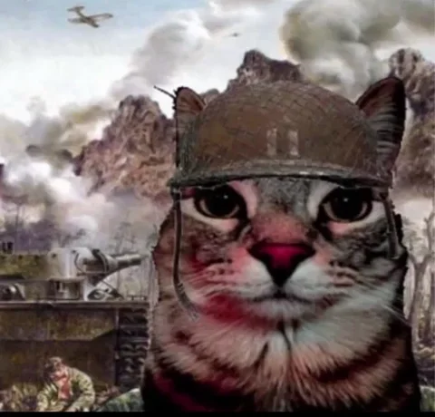

<h2> Hello there, I'm Yigit.  </h2>

<em>Game developer nothing much about me i just love coding.</em>  

 

 

Hello, I'm Yiğit. I've been interested in computers since I was 13-14 years old, and I've been in the industry since I was 18-19. My journey in game development began with Unity, and for over 1-1.5 years, I worked on casual projects, but currently, I'm developing playable advertisements in Unity and CocosCreator. I enjoy developing with Shader Graph, Editor Tools and Modular Systems. Additionally, I can use advanced tools like After Effects and Blender3D. I've developed various applications for Windows and Linux, which has given me knowledge in Python, C#, C++, and some TypeScript.

## 👨‍💻 Professional Skills

-  **Language:**  C#, C++, TypeScript, Python.
-  **Game Engines:**  Unity, Cocos Creator, Unreal Engine and Cocos2D-X (non-engine framework)
-  **Other Programs:**  After Effects, Blender3D, SQL Management Studio.
-  **Operation Systems:** Windows XP-11, Windows 2008-2012 R2, Kali Linux, Parrot Security OS.

## 🎓 Experience 

- Ruby Games Studio - 2 Years (Game Developer - Playable Ads Creator - Marketing Developer)
- Uncosoft - 6 Months (Game Developer)
- WeBold Creative - 6 Months (Lead Motion Designer)
- Zero Density - 1 Year, 1 Month (IT, IT Traniee)

## 💻 Newly Projects.

My newly projects (not so much)

<table>
  <tbody>
	<tr>
      <td><a href="https://github.com/xwbash/MetroHorrorGame"><b>🚇 Metro Horror Game</b></a></td>
      <td>My personal project i created in Unity.</td>
    </tr>
    </tr>
	  <tr>
      <td><a href="https://github.com/xwbash/HunterAssassin-Tiled"><b>🥷 Tiled System HA1 in Cocos2DX</b></a></td>
      <td>Tiled system i created for Hunter Assassin 1</td>
    </tr>
    </tr>
	  <tr>
      <td><a href="https://github.com/xwbash/Shine-Effect-UI-Unity"><b>✨ Shine Effect Shader</b></a></td>
      <td>This is just basic Unity shader.</td>
    </tr>
  </tbody>
</table>

## 🌌 Open Source Projects

These projects were built upon a very poor system, lacking in SOLID principles and far from object-oriented programming. They were developed during my education and exhibit a writing style devoid of SOLID principles and OOP.

<table>
  <tbody>
    <tr>
      <td><a href="https://github.com/xwbash/thebase"><b>🚀 PHP MySQL Admin System</b></a></td>
      <td>This project stands out from the others because I coded it using PHP, MySQL, HTML, and CSS. It's not a responsive website, but it can perform all functions. I learned the languages and wrote the entire program in 4 days.</td>
    </tr>
	  <tr>
      <td><a href="https://github.com/xwbash/PM"><b>🧑‍🎓 Student and Teacher Managment System</b></a></td>
      <td>This program is an advanced system for managing student and teacher accounts, including login and signup functionalities.</td>
    </tr>
    <tr>
      <td><a href="https://github.com/xwbash/Silverback-Application"><b>🦍 Silverback Databased Application</b></a></td>
      <td>The project utilizes Go, Kubernetes, RabbitMQ, MongoDB, Postgres, and a microservices architecture.</td>
    </tr>
    <tr>
      <td><a href="https://github.com/xwbash/system-a"><b>🚑 System-A</b></a></td>
      <td>This project was developed by me specifically for children with learning disabilities. It utilizes C# and Python programming languages. The libraries used include haarcascades, cryptology, OpenCV, and SMTP.</td>
    </tr>
  </tbody>
</table>
